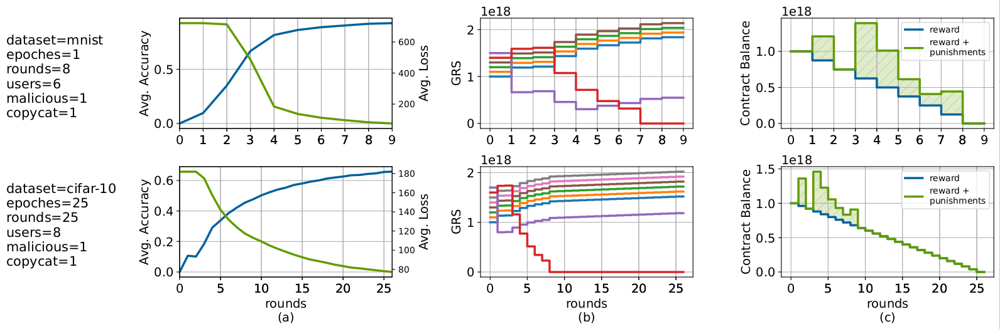

# OpenFL: Decentralized Federated Learning on Public Blockchain Systems

```
//  _______  _______  _______  _        _______  _          _______     _______
// (  ___  )(  ____ )(  ____ \( (    /|(  ____ \( \        / ___   )   (  __   )
// | (   ) || (    )|| (    \/|  \  ( || (    \/| (        \/   )  |   | (  )  |
// | |   | || (____)|| (__    |   \ | || (__    | |            /   )   | | /   |
// | |   | ||  _____)|  __)   | (\ \) ||  __)   | |          _/   /    | (/ /) |
// | |   | || (      | (      | | \   || (      | |         /   _/     |   / | |
// | (___) || )      | (____/\| )  \  || )      | (____/\  (   (__/\ _ |  (__) |
// (_______)|/       (_______/|/    )_)|/       (_______/  \_______/(_)(_______)
// by Anton Wahrstätter, Sajjad Khan and Davor Svetinovic
```


We propose and implement a decentralized federated learning environment that builds on top of the Ethereum blockchain.

This repository contains the following code:
```c++
* contracts/PubFLManager.sol -> Solidity
* contracts/PubFLModel.sol   -> Solidity
* api/smartcontracts.py -> Python3
* api/pytorch_model.py  -> Python3
* experiments/mnist_ropsten_experiment.ipynb -> Jupyter Notebook
* experiments/cifar10_ganache_experiment.ipynb -> Jupyter Notebook
```

We deploy our contracts to the following addresses (Ropsten Testnet):
* 0x8CDcb2082091c48BC90677C112fde145541dC519 ([Manager Contract](https://ropsten.etherscan.io/address/0x8CDcb2082091c48BC90677C112fde145541dC519#code))
* 0x059bff304F4653a1C290E368FE14cC36cB41461B ([Challenge Contract](https://ropsten.etherscan.io/address/0x059bff304f4653a1c290e368fe14cc36cb41461b))



